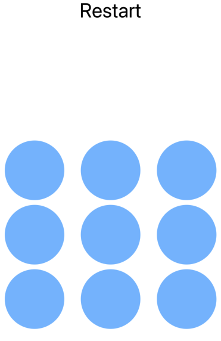
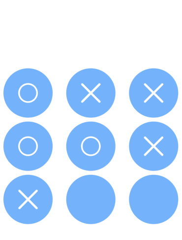

# TicTacToeSwift
Initial attempt at making an iOS application.

Nothing serious, just trying out MVVM in swift, understanding functional programming. 

Preparation for another swift application. :) 

## Ideas and help from Stanford iOS course and Sean Allen

### Some issues

- Curretly no Home Screen 
- Does not work in darkmode
- Does not support computer mode
- No animations

### Screen shots

Version 1.2 - June 25, 2021

